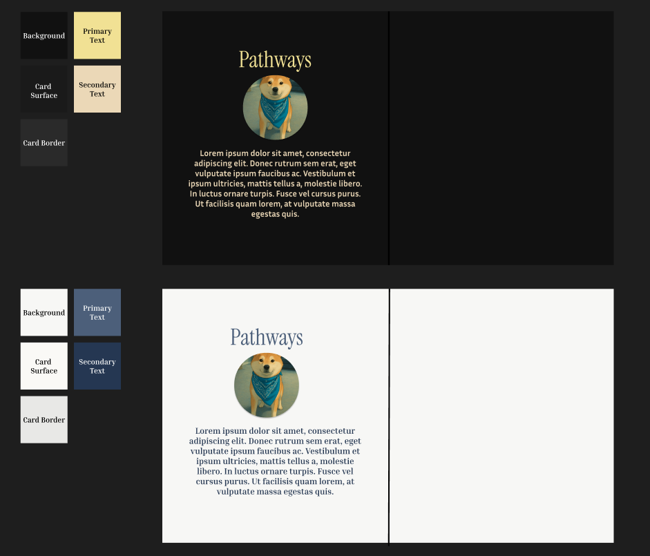
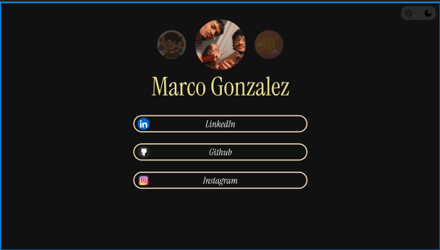
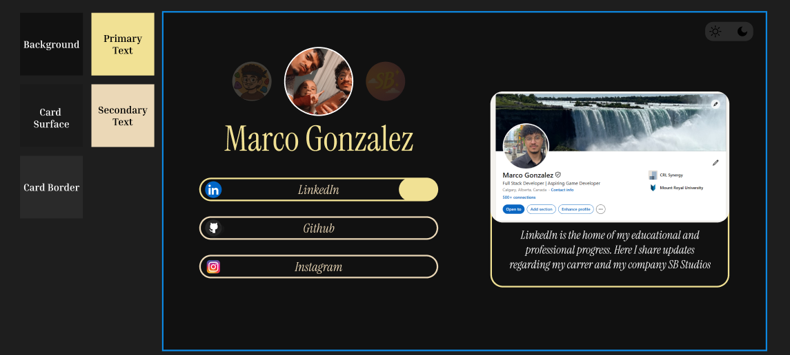
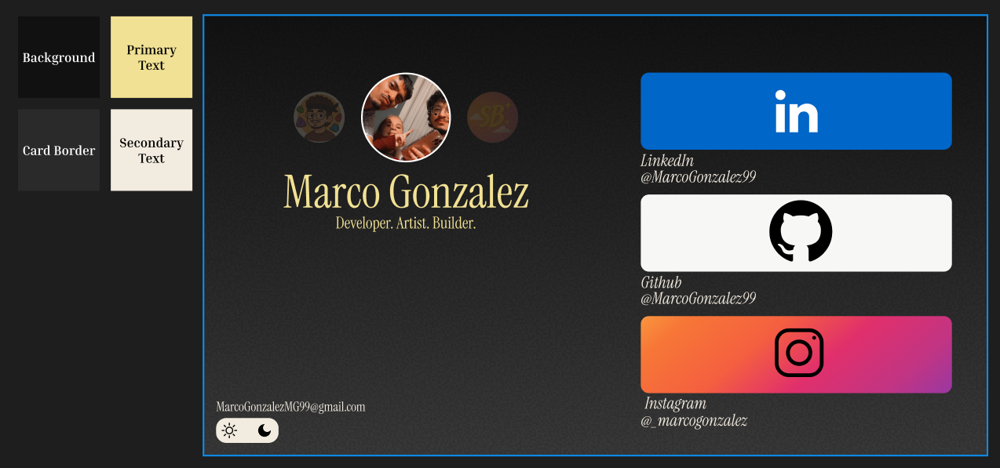
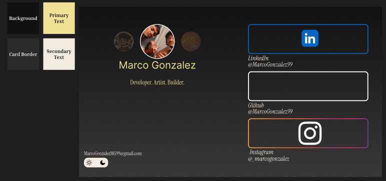
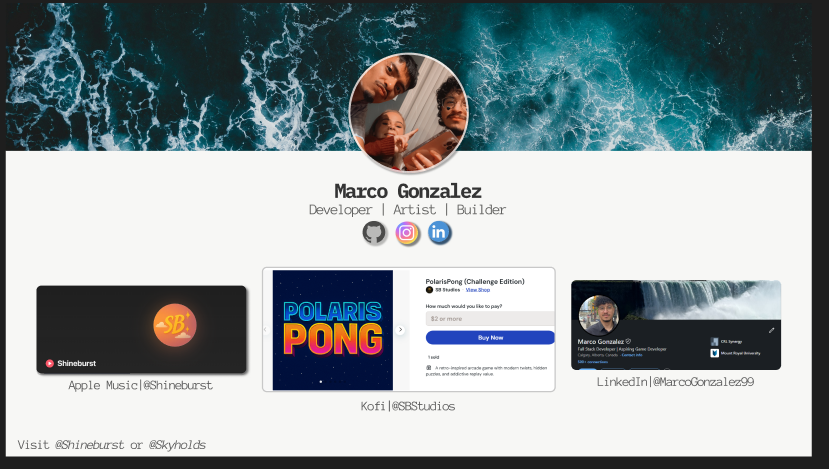
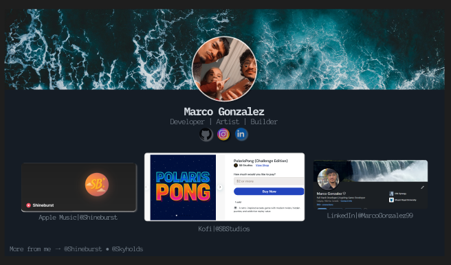
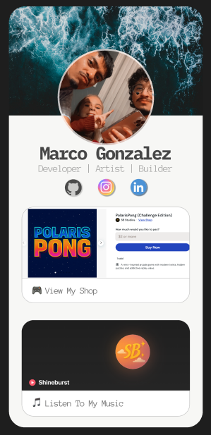

# Pathways

Welcome to **Pathways**, my personal self-hosted link hub.

## 🌟 What is Pathways?

It's a simple, minimal site where you can find all the important links I want to share in one place. 

## ❓ Why Pathways
Pathways was a great excuse to learn astro for the first time, as well as to have my own personal space to hold all my creations in one, easily accessible place. This project also serves as a nice way to practise my front end and creative design skills.

## ✨ Features

- Minimal, responsive design
- Dark and light theme toggle
- Fully customizable
- Free to host on GitHub Pages
- Simple updates via GitHub

## 🚀 Live Site

Live Site link will go here once it's ready

## 📦 Built With

- **Astro** for static site generation
- **Tailwind CSS** for styling, including dark mode support
- **JSON** for storing the links
- Hosted on **GitHub Pages**

## 💡 Ideas, Thought Process & Findings

This section documents the research, design decisions, and learnings made throughout the development of Pathways.

### Design (Iteration 1)

#### Findings & Learnings
For this first iteration, I tried to focus on the color scheme first. I aimed to choose my palette before I focused on the design and layout. One thing I did wrong during this step, was just assume a left/right side layout would work without thinking what each side's content would contain. Another thing I did not consider here, was the smaller device design. There were too many things to consider during this stage, therefore I decided this plan was not worth pursuing.

### Design (Iteration 2)

#### Findings & Learnings
For design 2, I tried a single column view, which would in the long run give me an easier time working on the mobile view, as that would most likely also be 1 column. The issue with this iteration would be the large chunks of dead space on the desktop version. With no good idea on how to proceed, I decided to move on from this version

### Design (Iteration 3)

#### Findings & Learnings
For version 3, I went back to the original idea of the 2 column design. This time, I was thinking of having preview cards when someone clicked on one of the links. For example, here I have LinkedIn selected, which opens a preview of my Linkedin Profile. This idea failed because the preview added an extra step to actually navigate. Another reason why this failed was due to the outdated design, and felt very flat.

### Design (Iteration 4)

#### Findings & Learnings
This iteration attempted to build upon the 2 column idea, with a new style for the right side. Instead of a preview, I tried to move the navigation buttons to this side. This looked good in theory, but in combination with the chosen colors, it did not work as well as I was anticipating

### Design (Iteration 5)

#### Findings & Learnings
For this version, the goal was to create a mobile version first, and then convert it to the desktop version second. With this, I looked into different websites that provide drag and drop templates for inspiration. I landed on the idea of a nice hero image on top, with a circle profile picture as the centerpiece. This version worked well, however I preferred using cards instead of just buttons.

## 🏆 Final Design

This is the final design that was picked for Pathways. I decided to go with the card design, for both the mobile version and the desktop version. I chose a main card, which will focus on my best project per account (Personal, Music, Bouldering, Game Dev).

The idea for this, is that I would have 4 pages, within this pathways site, and each branch would be present in their respective pages. I would have the same style for each page, different header, and hero image, so I am going to do JSON for main information, and then a set of cards to display, which should be 3. I am going to have my Github and LinkedIn as the two links always present
I have the following planned for each branch:

### Marco
- Instagram
- Music
- Bouldering YT

### Shineburst
- Apple Music
- Instagram
- Youtube

### SkyHolds
- Instagram
- Youtube
- Hopefully a sponsorship (coming soon for now)

### PolarisStudios
- Ko-fi
- Youtube
- Instagram

### Other Potential tabs
I would want one for my gaming channel, something for my baking or astrophotography, maybe something to showcase PolarisKit or Pong, a blog or something. However this stuff could be added in my actual website, for when I actually end up making one.
