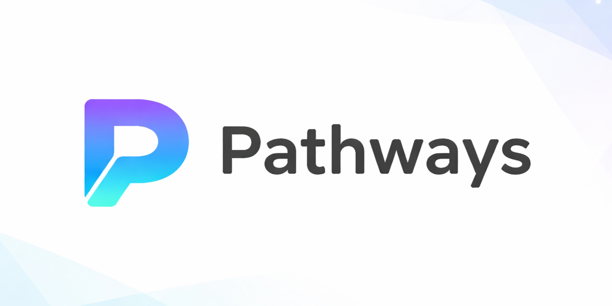

# Pathways

Welcome to **Pathways**, my personal self-hosted link hub.

## 🌟 What is Pathways?

It's a simple, minimal site where you can find all the important links I want to share in one place. The site is built with Astro and styled with Tailwind CSS, featuring a dark mode toggle and a responsive design that works well on both desktop and mobile. Each of my main identities (Personal, Music, Bouldering, Game Dev) has its own dedicated pathway page, where I highlight a featured project and provide links to relevant social media profiles and platforms.

## ✨ Features

- Responsive layout with mobile-first design
- Dark and light theme toggle
- Dedicated pathway pages per identity (Personal, Music, Bouldering, Game Dev)
- Highlight cards showcasing a featured project per pathway
- Link data driven by a typed TypeScript data file — no hardcoding required

<!-- ## 🚀 Live Site

Live Site link will go here once it's ready -->

## 🗂️ Project Structure

```
src/
├── components/
│   ├── DarkMode.astro
│   ├── LinkCard.astro
│   ├── ProfileCard.astro
│   ├── Sections.astro
│   └── SocialButtons.astro
├── data/
│   └── links.ts
├── layouts/
│   └── BaseLayout.astro
├── pages/
│   ├── index.astro
│   ├── shineburst.astro
│   ├── skyholds.astro
│   └── polaris.astro
└── styles/
    └── global.css
public/
└── images/
    ├── cards/
    ├── headers/
    ├── logos/
    └── social/
```

## 📦 Built With

- **Astro** for static site generation
- **Tailwind CSS** for styling, including dark mode support
- **TypeScript** for typed data management (`links.ts`)
- Hosted on **GitHub Pages**

## 💡 Ideas, Thought Process & Findings

This section documents the research, design decisions, and learnings made throughout the development of Pathways.

### Design (Iteration 1)


#### Findings & Learnings
For this first iteration, I tried to focus on the color scheme first. I aimed to choose my palette before I focused on the design and layout. One thing I did wrong during this step, was just assume a left/right side layout would work without thinking what each side's content would contain. Another thing I did not consider here, was the smaller device design. There were too many things to consider during this stage, therefore I decided this plan was not worth pursuing.

### Design (Iteration 2)


#### Findings & Learnings
For design 2, I tried a single column view, which would in the long run give me an easier time working on the mobile view, as that would most likely also be 1 column. The issue with this iteration would be the large chunks of dead space on the desktop version. With no good idea on how to proceed, I decided to move on from this version

### Design (Iteration 3)


#### Findings & Learnings
For version 3, I went back to the original idea of the 2 column design. This time, I was thinking of having preview cards when someone clicked on one of the links. For example, here I have LinkedIn selected, which opens a preview of my Linkedin Profile. This idea failed because the preview added an extra step to actually navigate. Another reason why this failed was due to the outdated design, and felt very flat.

### Design (Iteration 4)


#### Findings & Learnings
This iteration attempted to build upon the 2 column idea, with a new style for the right side. Instead of a preview, I tried to move the navigation buttons to this side. This looked good in theory, but in combination with the chosen colors, it did not work as well as I was anticipating

### Design (Iteration 5)


#### Findings & Learnings
For this version, the goal was to create a mobile version first, and then convert it to the desktop version second. With this, I looked into different websites that provide drag and drop templates for inspiration. I landed on the idea of a nice hero image on top, with a circle profile picture as the centerpiece. This version worked well, however I preferred using cards instead of just buttons.

## 🏆 Final Design
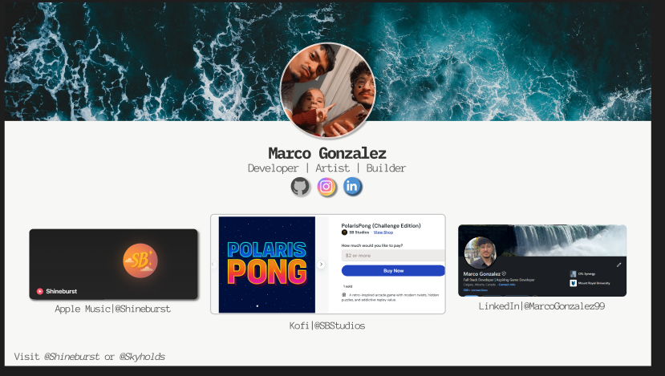
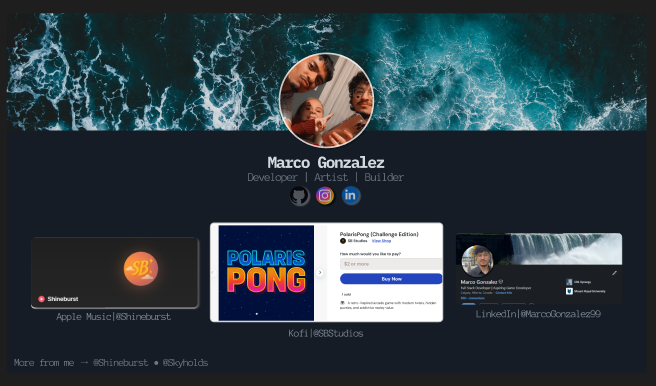
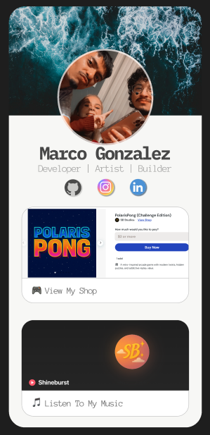

The final design uses a card-based layout that works consistently across both mobile and desktop. Each pathway has its own dedicated page, sharing the same structure but with a unique header and hero image, featuring a highlighted project card alongside a fixed set of social links.

Page data is managed through typed TypeScript data, keeping content updates straightforward and decoupled from the component structure.

### Marco
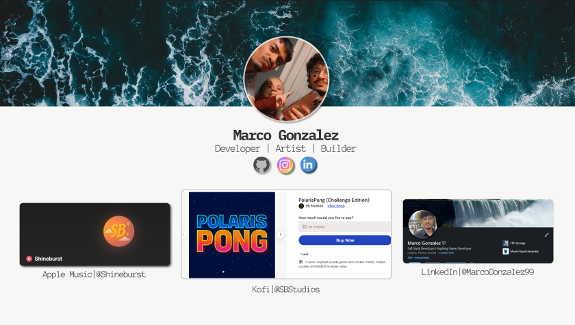
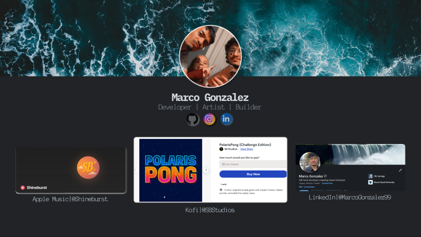
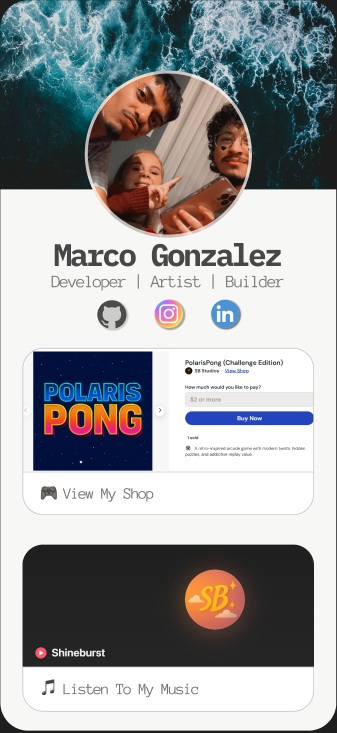
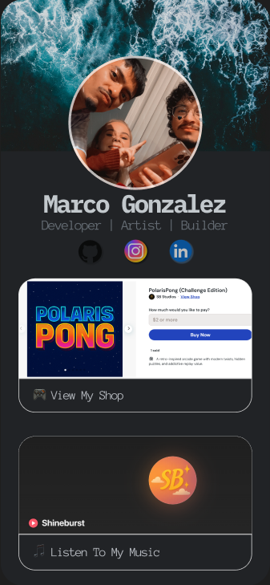

### Shineburst
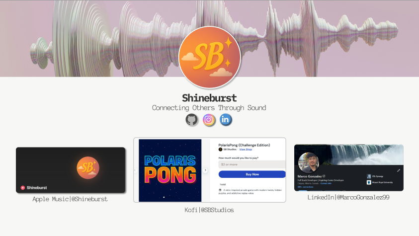
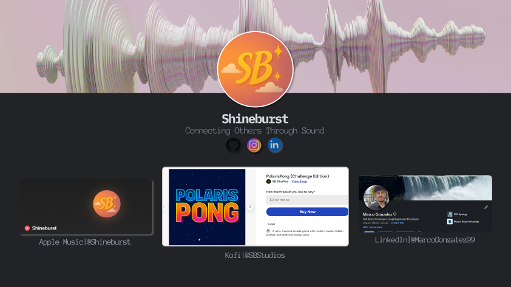
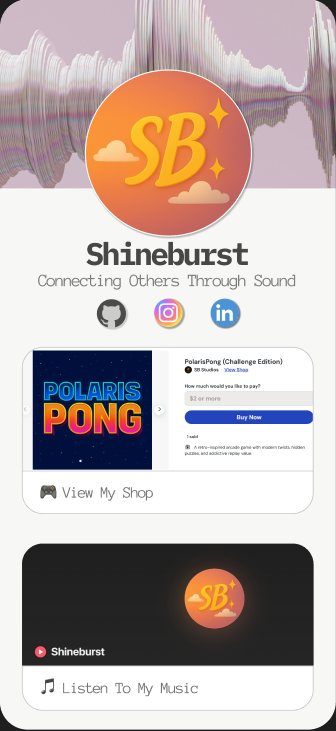
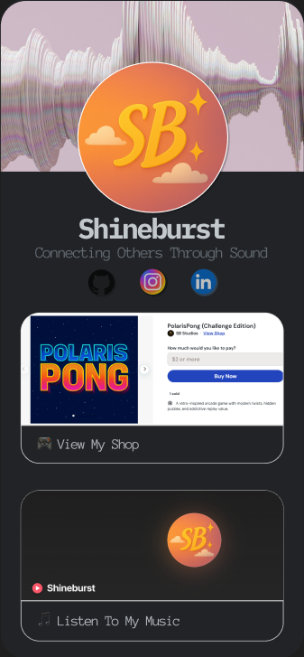

### SkyHolds
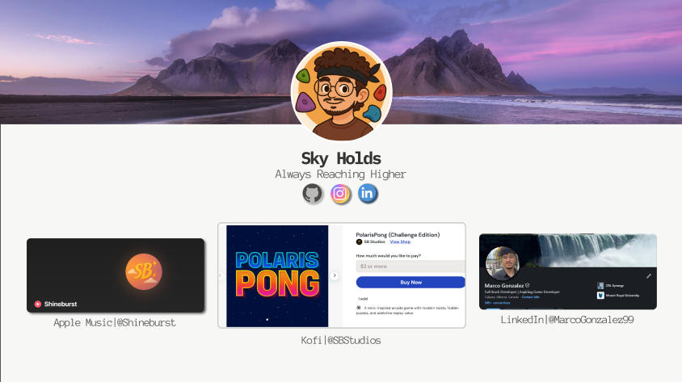
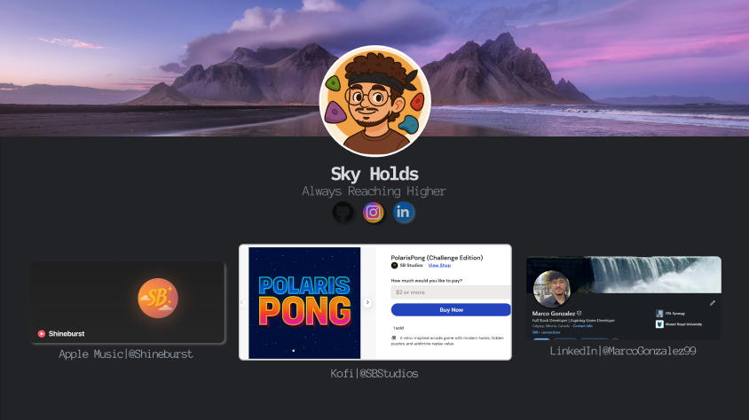
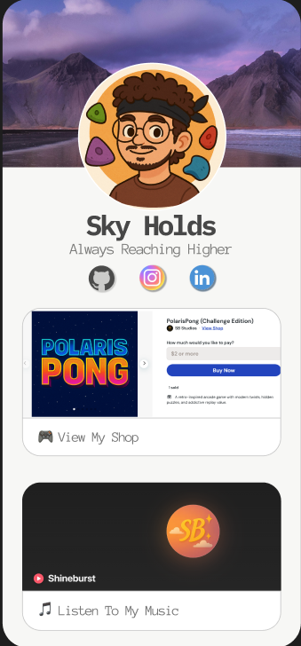
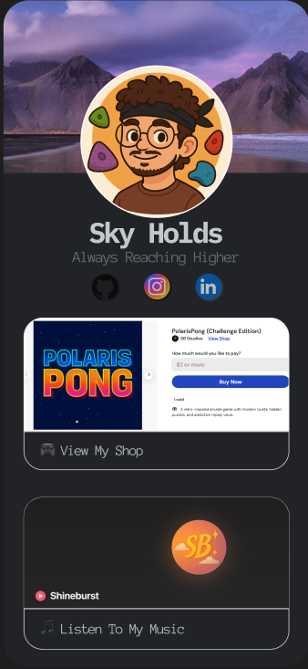

### PolarisStudios
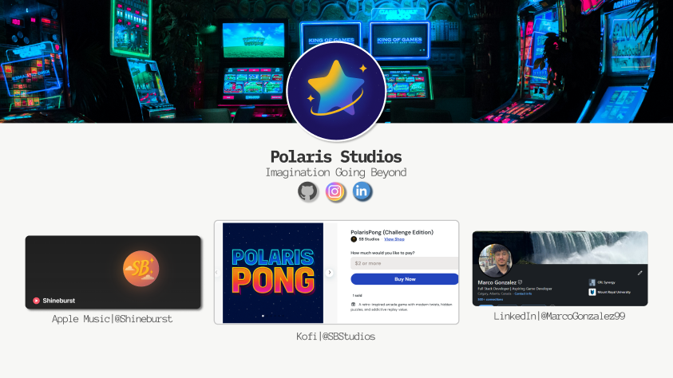
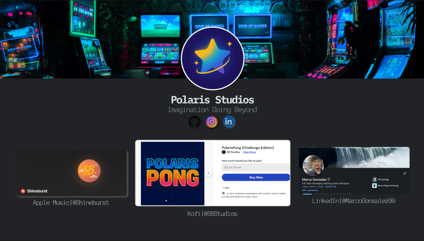
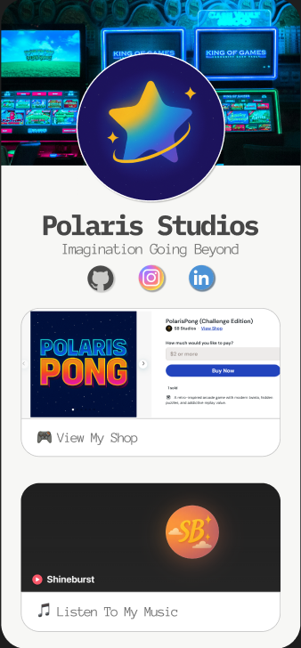
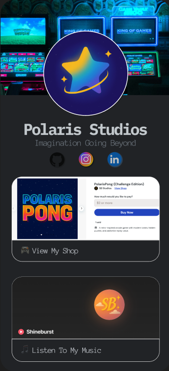


## 🗺️ Roadmap

Potential future pathways to add:

- Gaming channel
- Baking or astrophotography
- Projects showcase (PolarisKit, Pong)
- Blog

## Learnings, Takeaways & Insights

### SEO & Link Sharing
- `**robots.txt**` - Grants web crawlers (Googlebot for example) permissions to scan and index ths site. `Allow / ` makes all pages from the root onwards crawlable. 
- **Sitemap** - Improves SEO by providing search engines with a structured map of the site's URLs. This helps search engines discover and index content.
- **Open Graph & Meta Tags** - Added to `BaseLayout.astro`. When a link is shared on iMessage, Twitter or Discord, the tags added ensure the correct title, description and image are displayed in the preview.

### Accessibility
- **`focus-visible`** - Adds a glowing ring around a focused element, but only when the user is navigating with a keyboard and not clicking with a mouse. This is useful for accessibility, as it provides a clear visual indicator of which element is currently focused for keyboard users, without adding unnecessary visual noise for mouse users.
- **`accent_color` in `PageData`** - Each Pathway was given its own accent color, which is used for the focus ring, and in the future will be used for background particles and other small details.  
- **`aria-label`** - Provides labels for screen readers, which improves accessibility for users with visual impairments.

### Image Optimization
- **`loading="lazy"`** - The LinkCard component's images are set to lazy load. This means they are skipped on initial load, and are only loaded as they scroll into view 
- **`loading="eager"`** - The hero image and the profile image are set to eager load, meaining they will load as soon as possible. This is important for these two images as they are guarenteed to be in the viewport as soon as the page loads.
- **`decoding="async"`** - Image decoding is set to async, which allows a browser to render other content while the image is being decoded, improving page load performance.

## 📋 Future TODOs

- **Custom Cursor** — a two-layer JS cursor: small dot that snaps instantly + larger ring that follows with lag, themed with `var(--accent-color)` per pathway.
- **Particle Background** — canvas-based floating particles themed per pathway using `var(--accent-color)`.
- **Parallax Header** — header image scrolls slower than the page for a depth effect. Requires a JS scroll listener since CSS `background-attachment: fixed` is broken by `overflow: hidden` on ancestor elements.
- **Plausible Analytics** — privacy-friendly visitor tracking. Will show per-pathway visit counts once an account is set up at plausible.io.
- **Glowing hover effects** — accent-colored glow on cards and buttons for mouse users, complementing the existing focus ring for keyboard users.
