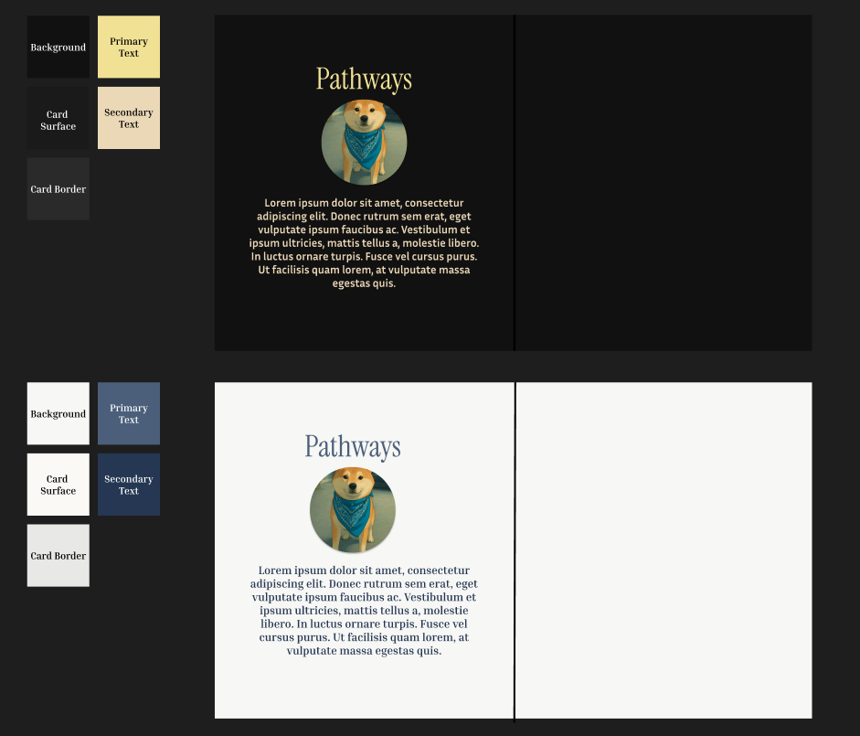
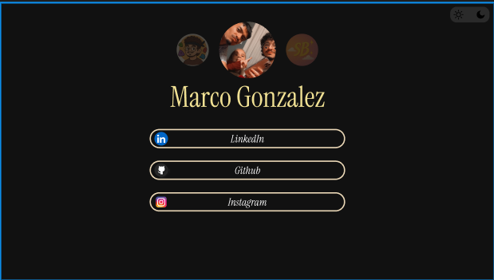
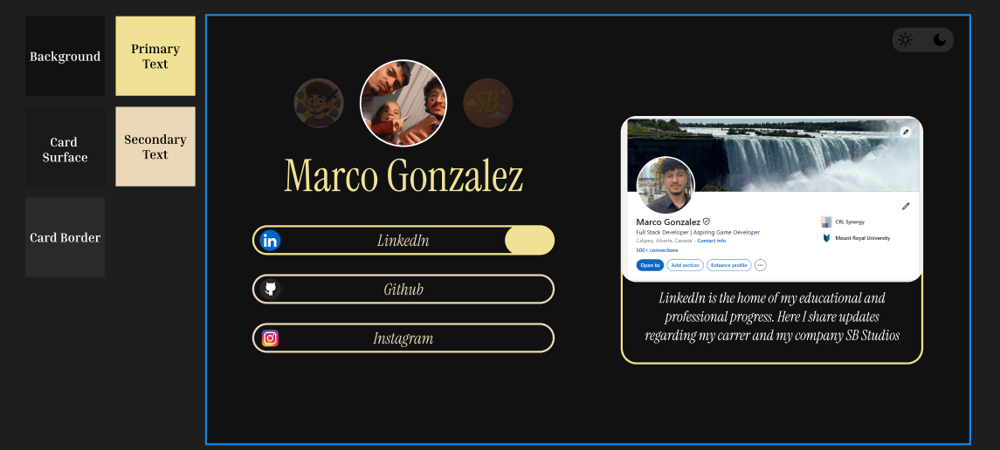
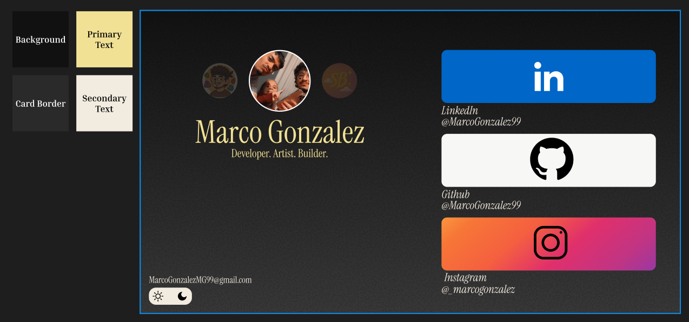
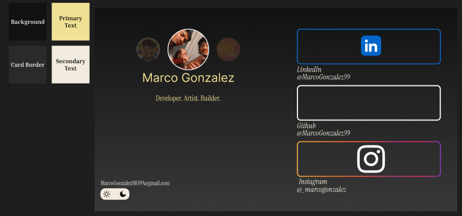
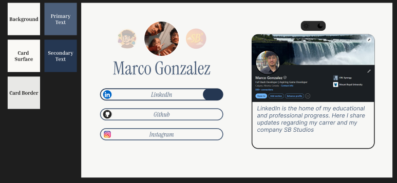
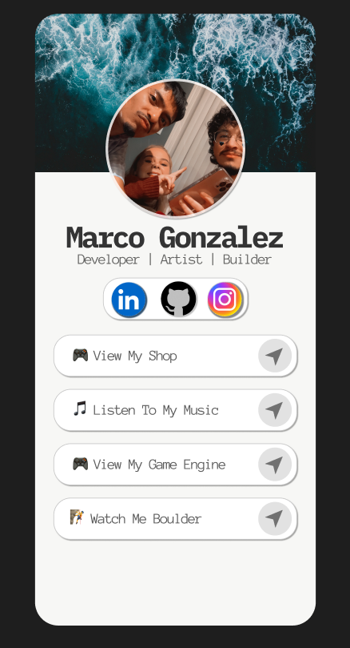

# Pathways

Welcome to **Pathways**, my personal self-hosted link hub.

## 🌟 What is Pathways?

It's a simple, minimal site where you can find all the important links I want to share in one place. 

## ✨ Features

- Minimal, responsive design
- Dark and light theme toggle
- Fully customizable
- Free to host on GitHub Pages
- Simple updates via GitHub

## 🚀 Live Site

Live Site link will go here once it's ready

## 📦 Built With

- **Astro** for static site generation
- **Tailwind CSS** for styling, including dark mode support
- **JSON** for storing the links
- Hosted on **GitHub Pages**

## 💡 Ideas, Thought Process & Findings

This section documents the research, design decisions, and learnings made throughout the development of Pathways.

### Design (Iteration 1)

#### Findings & Learnings
For this first iteration, I tried to focus on the colorscheme first. I aimed to choose my palette before I focused on the design and layout. One thing I did wrong during this step, was just assume a left/right side layout would work without thinking what each side's content would contain. Another thing I did not consider here, was the smaller device design. There were too many things to consider during this stage, therefore I decided this plan was not worth pursuing.

### Design (Iteration 2)

#### Findings & Learnings
For design 2, I tried a single column view, which would in the long run give me an easier time working on the mobile view, as that would most likely also be 1 column. The issue with this iteration would be the large chunks of dead space on the desktop version. With no good idea on how to proceed, I decided to move on from this version

### Design (Iteration 3)

#### Findings & Learnings

### Design (Iteration 4)

#### Findings & Learnings

### Design (Iteration 5)

#### Findings & Learnings

### Design (Iteration 6)

#### Findings & Learnings

### Design (Iteration 7)

#### Findings & Learnings
